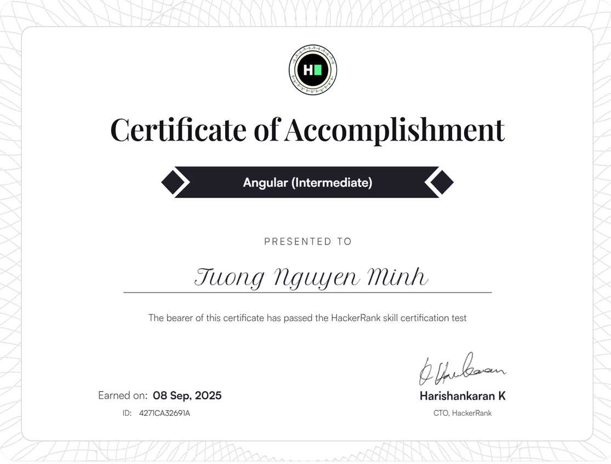
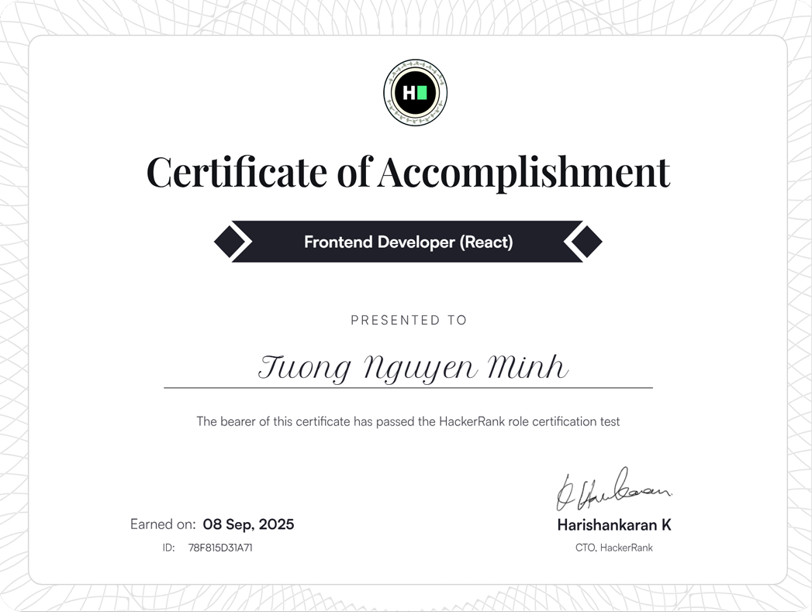
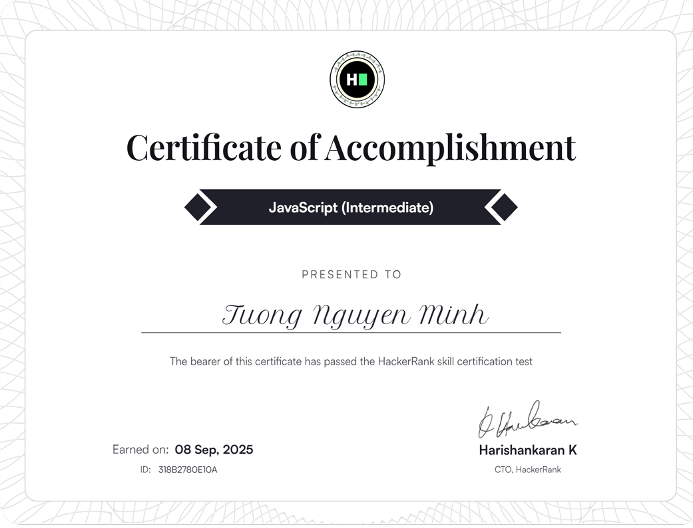
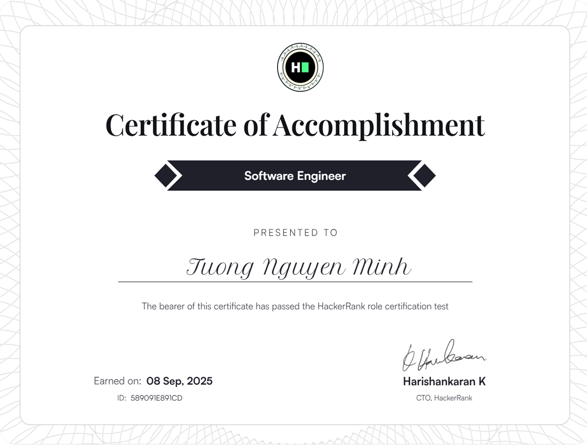
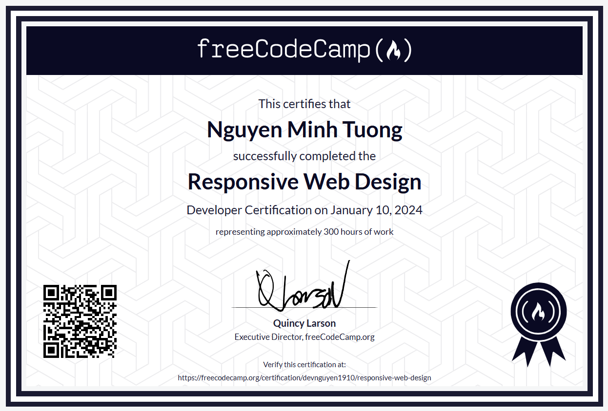

<div align="center">
  
</div>

<br>

<table width="100%" cellspacing="0" cellpadding="0" border="0">
<tr>
<td width="100%" valign="top">

<!-- Desktop: 55% width, Mobile: 100% stacked -->
<div style="display: inline-block; width: 100%; max-width: 600px; vertical-align: top; padding: 10px;">

## 👋 About Me

```typescript
const profile = {
  fullName: "Nguyen Minh Tuong",
  englishName: "Ryan Wilson",
  role: "Software Engineer",
  company: "VPSTech Co. LTD",
  location: "Ho Chi Minh City, Vietnam",
  dateOfBirth: "19/10/2003",
  experience: "Fresher, under 1 year",
  education: {
    university: "Nguyen Tat Thanh University",
    major: "Information Technology/Software Engineer",
    period: "2021 - 2025",
    gpa: "3.31 / 4.0"
  },
  motto: "Building value through stability and logic"
};
```

### 🎯 Career Objective

<div style="background: linear-gradient(135deg, #667eea 0%, #764ba2 100%); padding: 15px; border-radius: 10px; color: white;">
  
In the short term, I aim to develop myself as a **Fullstack Developer** specializing in **.NET technologies**, enhancing my programming skills and problem-solving abilities. In the future, I aspire to become a **Software Engineer** focusing on the .NET ecosystem, building high-performance systems and contributing meaningful value to the business.

</div>

### 💼 Work Experience

<details open>
<summary><b>Software Engineer</b> @ VPSTech Co. LTD</summary>

**Period:** 05/09/2025 - Now

- 🚀 Developing government digital solutions for Vietnamese public sector
- 💻 Building and maintaining enterprise web applications using .NET technologies

</details>

<details open>
<summary><b>Software Developer Intern</b> @ Digital Competence Company Limited</summary>

**Period:** 02/2025 - 05/2025

- ✅ Contributed to planning and developing a landing page website (ASP.NET Core) for course promotion, reaching an online class of 10 students
- ✅ Collaborated within Agile (Scrum) workflows, ensuring project progress and quality through effective teamwork
- ✅ Developed strong skills in communication during group tasks and reporting

</details>

### 📫 Connect With Me

[](https://www.linkedin.com/in/devnguyen1910/)
[](mailto:devnguyen1910@gmail.com)
[](https://wa.me/84329407627)
[](https://zalo.me/0329407627)
[](https://www.hackerrank.com/profile/devnguyen1910)

</div>

</td>
</tr>
<tr>
<td width="100%" valign="top" align="center">

<!-- Desktop: 45% width, Mobile: 100% stacked -->
<div style="display: inline-block; width: 100%; max-width: 400px; vertical-align: top; padding: 10px;">

<br>


<br><br>

### 🏆 Achievements

<table>
<tr>
<td align="center">

<br><b>Innovation Award</b>
<br><small>VPSTech 2024</small>
</td>
<td align="center">

<br><b>GPA 3.31/4.0</b>
<br><small>NTTU 2025</small>
</td>
</tr>
<tr>
<td align="center">

<br><b>MOS Specialist</b>
<br><small>Microsoft 2025</small>
</td>
<td align="center">

<br><b>CEFR B2</b>
<br><small>NIE 2023</small>
</td>
</tr>
</table>

### 📚 Certifications

<div align="left">

- 🥇 **Microsoft Office Specialist** (Word, Excel, PowerPoint) - 2025
- 🎓 **B2 English CEFR** (NTT | NIE English Program) - 2023
- 🏅 **Won Encouragement Prize** for Scientific Research at School Level

</div>

</div>

</td>
</tr>
</table>

---

<div align="center">

## 💻 Tech Stack

</div>

<table width="100%">
<tr>
<td width="33%" valign="top">

### Frontend
[](https://developer.mozilla.org/en-US/docs/Web/HTML)
[](https://developer.mozilla.org/en-US/docs/Web/CSS)
[](https://developer.mozilla.org/en-US/docs/Web/JavaScript)
[](https://angular.io/docs)
[](https://angular.io/guide/ssr)
[](https://react.dev/)
[](https://docs.nestjs.com/)
[](https://getbootstrap.com/docs/)
[](https://material.io/design)

### Backend
[](https://learn.microsoft.com/en-us/dotnet/)
[](https://learn.microsoft.com/en-us/aspnet/core/)
[](https://learn.microsoft.com/en-us/ef/)
[](https://learn.microsoft.com/en-us/sharepoint/dev/)
[](https://docs.oracle.com/en/java/)
[](https://nodejs.org/docs/)

</td>
<td width="33%" valign="top">

### Database
[](https://learn.microsoft.com/en-us/sql/)
[](https://www.postgresql.org/docs/)
[](https://dev.mysql.com/doc/)

### DevOps & Tools
[](https://git-scm.com/doc)
[](https://docs.github.com/)
[](https://docs.github.com/en/actions)
[](https://learn.microsoft.com/en-us/powershell/)
[](https://learn.microsoft.com/en-us/azure/)
[](https://docs.aws.amazon.com/)

### Integration & Security
[](https://auth0.com/docs)
[](https://jwt.io/introduction)
[](https://developers.google.com/gmail/api)

</td>
<td width="34%" valign="top">

### Development Tools
[](https://visualstudio.microsoft.com/docs/)
[](https://code.visualstudio.com/docs)
[](https://cursor.sh/)
[](https://learning.postman.com/docs/)
[](https://swagger.io/docs/)
[](https://learn.microsoft.com/en-us/microsoftteams/)
[](https://www.atlassian.com/software/jira/guides)

### Frameworks & Libraries
[](https://www.telerik.com/support/documentation)
[](https://docs.devexpress.com/)
[](https://learn.microsoft.com/en-us/nuget/)
[](https://jwt.io/)

</td>
</tr>
</table>

---

<div align="center">

## 🏢 Professional Projects


</div>

<br>

<details open>
<summary><h3>🔒 VPSTech Project | Server Monitoring & Intrusion Detection System</h3></summary>

24/7 real-time monitoring system detecting unauthorized uploads on ~10 Windows Servers. Features auto-classification of dangerous files, email alerts, web dashboard, and centralized monitoring. **Successfully detected real hacking attempts!** 🏆 Innovation Award Winner.

**Status:** ✅ Deployed 1+ year

</details>

<details>
<summary><h3>🏛️ VPSTech Project | Government Electronic Information Portals (×3)</h3></summary>

Official government websites for Chi cục ATTP Phú Thọ, Phường Thống Nhất, and Xã Thịnh Minh with shared backend architecture. Includes news/document management, image gallery, Angular SSR for SEO, responsive design, and secure authentication.

**Status:** ✅ Production

</details>

<details>
<summary><h3>📋 VPSTech Project | Citizen Complaints & Denunciations System</h3></summary>

Comprehensive complaint lifecycle management system for Yên Bình District following Vietnamese government procedures. Features role-based assignment, VGCA digital signature, X-Road e-document exchange, automated SMS notifications, and interactive dashboards.

**Status:** ✅ Production

</details>

<details>
<summary><h3>🏘️ VPSTech Project | Poor Household Database Management System</h3></summary>

Provincial-scale social welfare system tracking deprivation indicators across Phú Thọ. Includes household registration, 12 social indicators tracking, Excel import with preview, analytics charts, multi-level approval workflow, and SSO/X-Road integration.

**Status:** ✅ v1.0 (January 2026)

</details>

<details>
<summary><h3>💬 VPSTech Project | Citizen Feedback & Petitions System</h3></summary>

Structured feedback management platform with processing workflow and inter-agency data exchange capabilities for handling citizen petitions and suggestions.

**Status:** ✅ Production

</details>

<details>
<summary><h3>🌐 VPSTech Project | SharePoint Government Portals</h3></summary>

Custom SharePoint portals for BQL and Sở KHCN with custom web parts, event receivers, workflows, and WSP package deployment.

**Status:** ✅ Deployed

</details>

<details>
<summary><h3>🗺️ VPSTech Project | Vietnam Administrative API (Post-2025 Merger)</h3></summary>

RESTful API serving Vietnam''s updated administrative hierarchy (63 provinces, 713 districts, 3,321 wards/communes) after 2025 mergers. Includes 9 REST endpoints, SQL seed scripts, and interactive test page.

**Tech:** Node.js, Express 5, Python pandas  
**Status:** ✅ Active

</details>

---

<div align="center">

## 🎓 Student Projects


</div>

<br>

<details>
<summary><h3>📚 Web-Based Platform for School Equipment Management</h3></summary>

Developed a comprehensive web-based system for managing school equipment, allowing users to track device status, schedule maintenance based on wear and tear over time, and automatically generate maintenance plans by condition. The system also supports notifications, reporting, and role-based access permissions.

**Tech:** ASP.NET MVC/Core (C#/.NET), Telerik UI, SQL Server  
**Source Code:** https://github.com/tuongnguyen1910/assets-management  
**Period:** 02/2025 - 05/2025  
**Achievement:** 🏅 Won encouragement prize for scientific research at school level

</details>

<details>
<summary><h3>🛒 Web-Based E-Commerce Platform</h3></summary>

Developed an e-commerce website with core functionalities such as product management, customer management, online payment, order and delivery management. The system supports creating invoices, managing inventory, stock levels, applying promotions/discount codes, and generating reports on revenue, best-sellers, and inventory.

**Tech:** ASP.NET MVC (C#/.NET), Bootstrap 5+, SQL Server, Azure  
**Source Code:** https://github.com/devnguyen1910/ecommerce-site  
**Period:** 10/2024 - 01/2025

</details>

<details>
<summary><h3>🪑 Desktop Application for Furniture Management</h3></summary>

Developed a desktop application for managing furniture sales and inventory, supporting product, customer, and material information maintenance. The system enables users to manage sales orders, print invoices, track inventory levels, manage user access roles, and generate reports on sales, stock levels, and material usage.

**Tech:** WinForms (C# .NET), SQL Server Express  
**Source Code:** https://github.com/ginherick/Winform_DNCI921_QLBH  
**Period:** 02/2024 - 04/2024

</details>

---

<div align="center">

## 📸 Gallery & Achievements

</div>

<br>

<div align="center">

### 👨‍💻 Professional Moments

<table style="width: 100%;">
  <tr>
    <td align="center"><a href="./image/README/anh_1.jpg"></a></td>
    <td align="center"><a href="./image/README/anh_2.jpg"></a></td>
    <td align="center"><a href="./image/README/anh_4.jpg"></a></td>
  </tr>
</table>

<br>

### 🏆 Certifications

<div align="left">

<details>
<summary><b>📜 Microsoft Office Specialist (Word, Excel, PowerPoint) - 2025</b></summary>
<br>

</details>

<details>
<summary><b>🎓 B2 English CEFR (NTT | NIE English Program) - 2023</b></summary>
<br>

</details>

<details>
<summary><b>🏅 Scientific Research Encouragement Prize - NTTU</b></summary>
<br>

</details>

<details>
<summary><b>🎯 Additional Certifications (2 more)</b></summary>
<br>
<table style="width: 100%;">
  <tr>
    <td align="center"></td>
    <td align="center"></td>
  </tr>
</table>
</details>

</div>

</div>

---

<div align="center">

## 📊 GitHub Statistics

</div>

<br>

<div align="center">


</div>

---

<div align="center">

## 💭 Quote of the Day


</div>

---

<div align="center">

### 📈 Contribution Graph


</div>

---

<div align="center">


<br><br>


<br><br>

### ⭐ From [tuongnguyen913](https://github.com/tuongnguyen913) with 💙


</div>
